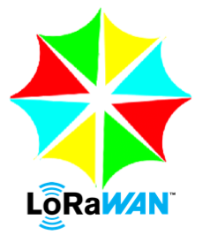

# LoRaWAN Documentation

# Tutoriais 

- [Gateway LoRaWAN com Raspberry Pi](https://github.com/eron93br/lorawan/tree/master/rpi-gtw)

# LoRaWAN Recife community

[TTN Recife Community\(https://www.thethingsnetwork.org/community/recife/)

soon.... em breve.....

Contato eron93@gmail.com 

# Meus artigos sobre LoRa

- [The Things Network: uma rede para IoT colaborativa](https://www.embarcados.com.br/the-things-network-rede-iot/)'
- [Gateways LoRa: soluções open-source hardware](https://www.embarcados.com.br/gateways-lora-open-source-hardware/)
- [Criando end-devices LoRa: arquitetura e especificações](https://www.embarcados.com.br/end-devices-lora-arquitetura/)
- [Plataformas de desenvolvimento baseadas em LoRa](https://www.embarcados.com.br/plataformas-baseadas-em-lora/)

# Referencias LoRaWAN

- [Conectar Gateway Dragino na TTN](http://wiki.dragino.com/index.php?title=Connect_to_TTN)
- [Criando LoRaWAN node](https://tutorial.cytron.io/2017/09/15/lesson-1-build-simple-arduino-lora-node-10-minutes/)
- [Cytron LoRa shield](https://www.cytron.io/p-shield-lora-rfm?_ga=2.106107146.841538676.1522541014-368293828.1522541014)
