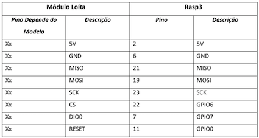

# Documentação gateway LoRaWAN

Gateway LoRaWAN de unico canal baseado em Raspberry Pi

Baseado na implementacao de [Thomas Telkamp](https://github.com/tftelkamp/single_chan_pkt_fwd)
Contribuicao principal feita por [Thiago Campos](https://github.com/tcampos123)

Testes realizados por [Marcus Felipe](https://github.com/mfrr) e [Eronides Neto](github.com/eron93br)

Editado para funcionar com parametros em rede brasileira

Funcionalidades básicas 
--------
- Compatível com freqüências configuráveis (915MHz, 902MHz etc) e mudança do fator de espalhamento (spreadin factor)
- Spreading factor (SF7 to SF12)
- Status de update

Não suportado
--------
- ACK de mensagem
- Modulação SF7BW250 
- Modulação FSK
- Mensagens de downlink (downstream)

Conexões (Pinout)
===========



Tutorial Parte 1 - Configurando o Gateway no RPi
-------------

### Material  necessário:

- Raspberry Pi 3 (ou 2 conectado a Internet)
- Registro na TTN (The Things Network)
- Transceiver LoRa Semtech SX1272 (HopeRF RFM92W), ou SX1276 (HopeRF RFM95W).

A) Atualize o Raspberry Pi para a versão mais recente do S.O.
````
sudo apt-get update

sudo apt-get upgrade
````

B) Instale a biblioteca SPI via a linha de comando do terminal

````
sudo apt-get install wiringpi
````
De preferência, habilite o SPI, VNC, SSH por praticidade via comando 
````raspi-config ````

C) Realize as conexoes físicas do transceiver LoRa com o Raspberry Pi como descritas acima!!

Em seguida vamos comecar a configuração do gateway, siga o passo a passo!

1) Abra o Terminal e Crie um diretório que ficará os arquivos e bibliotecas do LoRa! Em seguida entre na pasta criada. 
````
mkdir lorawan_gateway
cd lorawan_gateway
````
2) Realize o [download](https://github.com/tftelkamp/single_chan_pkt_fwd) SIngle Channel Lora Gateway (Os arquivos ficarão dentrodo diretório criado) 
````
git clone https://github.com/tftelkamp/single_chan_pkt_fwd.git 
````

3) Feito Download, abra a subpasta criada conforme passo anterior ````cd single_chan_pkt_fwd````

4) Dentro do Subdiretório, editar o arquivo main.cpp ````sudo nano main.cpp````


Editar as partes em vermelho para a configuração desejada! 
- Por exemplo, coloque a frequencia para 914.9MHz (914900000), a informacao da localizacao do gateway a partir de sua localizacao exata ou aproximada (latitude e longitude) e altitude do setup do gateway. 
- Coloque o nome do seu dispositivo (Single Channel Gateway)
- No campo e-mail coloque o seu e-mail cadastrado na TTN.
- Nome do seu gateway...
- Em Server1 o seu IP 

Confira o exemplo do meu [arquivo](https://github.com/eron93br/lorawan/blob/master/rpi-gtw/main.cpp)

Feita as alterações, salve ````CTRL+X -> Y (Yes) -> Enter````

5) Ainda no Subdiretório, compile o código com terminal e em seguida reinicie o Raspberry Pi. 
````
make
sudo reboot
````
6) Inicie e teste seu gateway :)
````
cd lorawan_gateway/single_chan_pkt_fwd
sudo ./single_chan_pkt_fwd
````
Ao executar a linha de comando, aparecerá na tela informações sobre o gateway como, ID, email etc...


Tutorial Parte 2 - Configurando o Gateway na The Things Network
-------------
1) Crie uma conta na The Things Network
````
    Login no site console.thethingsnetwork.org (gratuito!)
    Selecione 'Gateways' 
    Selecione + register gateway (Registrar Gateway)
````


2) Coloque o gateway ID que vc configurou anteriormente (campo Gateway EUI), passo 6 da Parte 1, no inicio da pagina e selecione registrar gateway.


3) Rode o gateway e bote pra quebrar! :)
````sudo /home/pi/single_chan_pkt_fwd/single_chan_pkt_fwd````

Assim que seu gateway estiver ativado apacera um status na sua pagina, console.thethingsnetwork.org

Outros tutoriais 
-------
[Tutorial para criação do endpoint LoRaWAN](https://github.com/eron93br/lorawan/tree/master/rpi-gtw/endpoint)

License
-------
The source files in this repository are made available under the Eclipse Public License v1.0, except:

base64 implementation, that has been copied from the Semtech Packet Forwarder;
RapidJSON, licensed under the MIT License.
