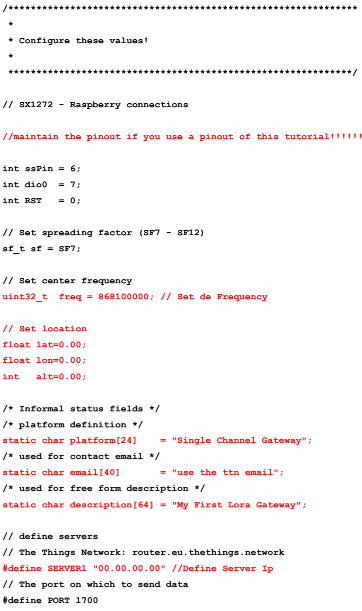
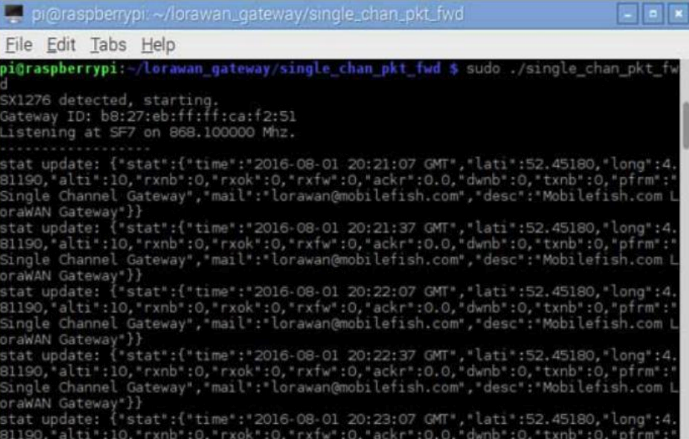

Gateway LoRaWAN de unico canal baseado em Raspberry Pi

Baseado na implementacao de [Thomas Telkamp](https://github.com/tftelkamp/single_chan_pkt_fwd)
Contribuicao principal feita por [Thiago Campos](https://github.com/tcampos123)

Testes realizados por [Marcus Felipe](https://github.com/mfrr) e [Eronides Neto](github.com/eron93br)

Editado para funcionar com parametros em rede brasileira

Funcionalidades
--------
- listen on configurable frequency and spreading factor
- SF7 to SF12
- status updates
- can forward to two servers

Nao suporta
--------
- PACKET_PUSH_ACK processing
- SF7BW250 modulation
- FSK modulation
- downstream messages (tx)

Connections
-----------
SX1276 - Raspberry

3.3V   - 3.3V (header pin #1) 
GND	   - GND (pin #6)
MISO   - MISO (pin #21)
MOSI   - MOSI (pin #19)
SCK    - CLK (pin #23)
NSS    - GPIO6 (pin #22)
DIO0   - GPIO7 (pin #7)
RST    - GPIO0 (pin #11)

Tutorial Parte 1 - Gateway com RPi
-------------

### Material  necessario:

- Raspberry Pi 3 (ou 2 conectado a Internet)
- Registro na TTN (The Things Network)
- Transceiver LoRa Semtech SX1272 (HopeRF RFM92W), ou SX1276 (HopeRF RFM95W).

A) Atualize o Raspberry Pi para a versao mais recente do S.O.
````
sudo apt-get update

sudo apt-get upgrade
````

B) Instale a biblioteca SPI via a linha de comando do terminal

````
sudo apt-get install wiringpi
````
De preferencia, habilite o SPI, VNC, SSH por praticidade via comando 
````raspi-config ````

Em seguida vamos comecar a configuracao do gateway, siga o passo a passo!

1) Abra o Terminal e Crie um diretório que ficará os arquivos e bibliotecas do LoRa! Em seguida entre na pasta criada. 
````
mkdir lorawan_gateway
cd lorawan_gateway
````
2) Realize o download SIngle Channel Lora Gateway (Os arquivos ficarão dentrodo diretório criado) 
````
git clone https://github.com/tftelkamp/single_chan_pkt_fwd.git 
````

3) Feito Download, abra a subpasta criada conforme passo anterior ````cd single_chan_pkt_fwd````

4) Dentro do Subdiretório, editar o arquivo main.cpp ````sudo nano main.cpp````



Editar as partes em vermelho para a configuracao desejada! 
- Por exemplo, coloque a frequencia para 914.9MHz (914900000), a informacao da localizacao do gateway a partir de sua localizacao exata ou aproximada (latitude e longitude) e altitude do setup do gateway. 
- Coloque o nome do seu dispositivo (Single Channel Gateway)
- No campo e-mail coloque o seu e-mail cadastrado na TTN.
- Nome do seu gateway...
- Em Server1 o seu IP 

Feita as alterações, salve ````CTRL+X -> Y (Yes) -> Enter````

5) Ainda no Subdiretório, compile o código com terminal e em seguida reinicie o Raspberry Pi. 
````
make
sudo reboot
````
6) Inicie e teste seu gateway :)
````
cd lorawan_gateway/single_chan_pkt_fwd
sudo ./single_chan_pkt_fwd
````
Ao executar a linha de comando, aparecerá na tela informações sobre o gateway como, ID, email etc...




### codigo

````c++
/*
  Pisca LED - Blink

  Esse exemplo exibe como piscar o LED presente na placa ou um LED externo ligado ao pino 1 da Franzininho em intervalos de 1 segundo.

*/

const int LED = 1; //pino digital conectado ao LED

void setup(){
  pinMode(LED,OUTPUT); //pino digital de saída
}

void loop(){
  digitalWrite(LED,HIGH);   //acende o led da placa
  delay(1000);             //aguarda um segundo
  digitalWrite(LED,LOW);  //apaga o led da placa
  delay(1000);           //aguarda um segundo
}

````


License
-------
The source files in this repository are made available under the Eclipse
Public License v1.0, except for the base64 implementation, that has been
copied from the Semtech Packet Forwader.
